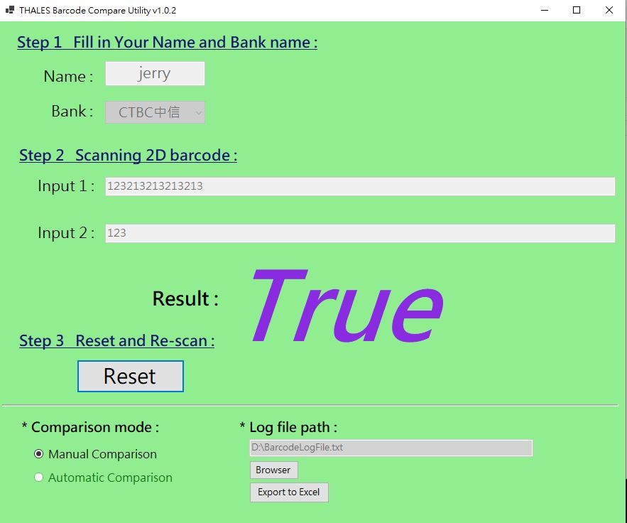
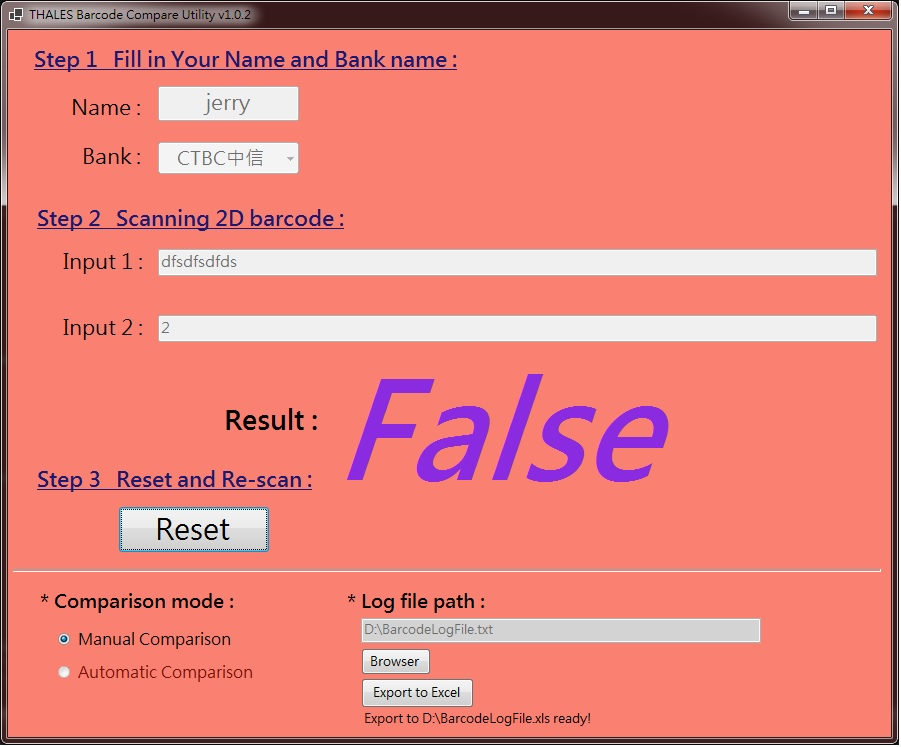

# BarcodeScanner
The utility be designed to scanning the 2D barcode and compare the sting whether the same or not.

# Bin path
barcode3/bin/Release/netcoreapp3.1/

# Pre-processing
Need Windows .NET framework 3.1 installed

# Usage:
1. Creat a log file named "Sample.txt" under D:\Download\Sample.txt and make sure the file could be read/write by users.
2. If wanna to change the directory must copy all the files in barcode3/bin/Release/netcoreapp3.1/

# Example:

