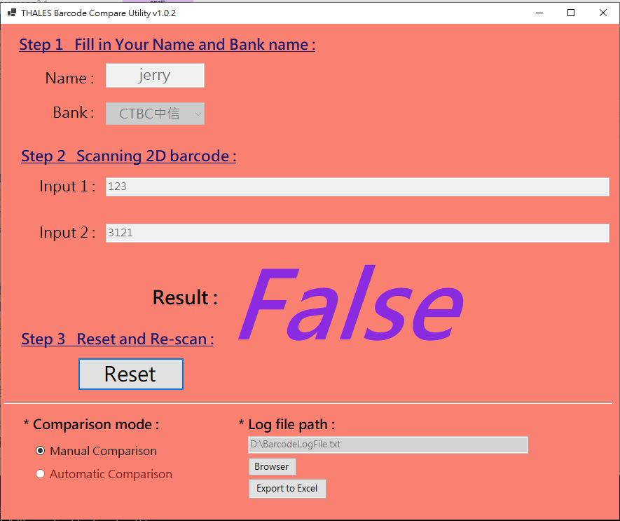

# Barcode Scanner:
 - It's the utility designed to scanning the 2D barcode and compare the sting whether the same or not.

# Binary path:
 - barcode3/bin/Release/netcoreapp3.1/
 - (If needs move the bin file, please move whole directory)

# Pre-processing:
 - Need Windows .NET framework 3.1 installed

# Example:
 - Output true

 - Output false

# Release:
    - v1.0.1
        1. Fix input null string bug
        2. Window re-size locked
        3. If log file not exist, create it!
        4. Implement log browser function
        5. Log file separate by ";"
        6. Enhancement of reset by space or enter key

    - v1.0.0
        * Init version
